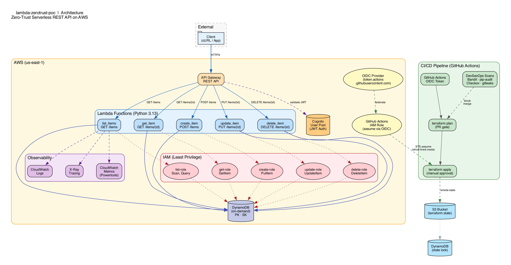

# Lambda Zero-trust PoC

Zero-trust serverless REST API on AWS — PoC demonstrating DevSecOps best practices, least-privilege IAM, and GitHub OIDC deployment with no long-lived credentials.



## What This Project Shows

- **Zero-trust CI/CD**: GitHub Actions assumes an AWS IAM role via OIDC — no static keys, no secrets in GitHub
- **Least-privilege IAM**: Each Lambda function gets its own IAM role scoped to a single DynamoDB action on a single table
- **DevSecOps pipeline**: SAST (Bandit), SCA (pip-audit), IaC scan (Checkov), secrets scan (gitleaks) — all blocking CI checks
- **Observability**: Lambda Powertools for structured logging, X-Ray tracing, and CloudWatch metrics
- **Fully reproducible infra**: Terraform modules with remote state in S3 + DynamoDB lock table

## Architecture

```
Client ──HTTPS──▶ API Gateway (REST) ──▶ Lambda (Python 3.13) ──▶ DynamoDB (on-demand)
                       │                         │
                       │ validate JWT            ├── CloudWatch Logs (structured JSON)
                       ▼                         ├── X-Ray Tracing
                  Cognito User Pool              └── CloudWatch Metrics
                                                     (Powertools)
```

**Routes:**

| Method | Path | Lambda | DynamoDB Action |
|--------|------|--------|-----------------|
| GET | `/items` | `list_items` | Scan, Query |
| GET | `/items/{id}` | `get_item` | GetItem |
| POST | `/items` | `create_item` | PutItem |
| PUT | `/items/{id}` | `update_item` | UpdateItem |
| DELETE | `/items/{id}` | `delete_item` | DeleteItem |

## Security Model

### Zero-Trust Deployment

No long-lived AWS credentials exist anywhere in this repo or in GitHub. The CI/CD pipeline uses **GitHub OIDC federation**:

1. GitHub Actions requests an OIDC token
2. AWS STS validates the token against the OIDC provider
3. STS assumes a short-lived IAM role (scoped to the repo, branch, and environment)
4. Terraform uses the temporary credentials to deploy

There is one IAM role per environment (`terraform/oidc.tf`). Each role's trust
policy conditions restrict access to:
- `aud: sts.amazonaws.com` — OIDC tokens are only accepted by STS
- dev role, `sub: repo:<org>/<repo>:ref:refs/heads/*` and `ref:refs/pull/*` — branch pushes + PRs
- prod role, `sub: repo:<org>/<repo>:ref:refs/heads/main` — main only

### Least-Privilege IAM

Each Lambda function has:
- **Its own IAM role** (no shared roles)
- **One custom policy** with a single DynamoDB action scoped to the table ARN
- **AWSLambdaBasicExecutionRole** for CloudWatch Logs
- **AWSXRayDaemonWriteAccess** for X-Ray tracing

## Prerequisites

- Docker (Floci runs as a container)
- Python 3.13+
- Terraform >= 1.10
- Make

## Quick Start — Local Development

```bash
# 1. Start Floci (local AWS emulator), create remote state store, and deploy
make floci-up && make tf-bootstrap && make up

# 2. Verify everything works
curl http://localhost:4566/restapis/<api_id>/dev/_user_request_/items \
  -H "Authorization: test"

# 3. When done, tear down
make down
```

> `make tf-bootstrap` is a one-time step that creates the S3 state bucket + DynamoDB
> lock table (in `terraform/bootstrap/`). Subsequent runs only need `make up`.

### What `make up` Does

1. Starts Floci Docker container (emulates AWS on port 4566)
2. Runs `scripts/build-lambda.sh` to package Lambda functions with dependencies
3. Runs `terraform init` (S3 backend pointed at Floci) and `terraform apply`

### Useful Commands

```bash
make help              # Show all targets
make floci-status      # Check Floci container
make floci-health      # Health check
make tf-bootstrap      # One-time: create state bucket + lock table
make tf-init           # Init with Floci backend (default)
make tf-init-aws       # Init with real AWS backend
make build-lambdas     # Rebuild Lambda packages
make tf-plan           # Preview Terraform changes
make tf-apply          # Apply Terraform changes
make lint              # Run ruff linter
make test              # Run pytest
make clean             # Remove caches and build artifacts
```

## Deploy to AWS

> **Requires**: AWS account, GitHub repository, OIDC provider configured

```bash
# Set variables
export TF_VAR_github_org="your-org"
export TF_VAR_github_repo="your-repo"

# One-time: create the remote state bucket + lock table (run once, real AWS)
terraform -chdir=terraform/bootstrap init
terraform -chdir=terraform/bootstrap apply -auto-approve

# Initialize (S3 remote backend on real AWS)
cd terraform && terraform init -backend-config=backend-aws.tfvars

# Plan
terraform plan -var="use_localstack=false" -var-file=terraform.tfvars.example

# Apply (requires manual approval in production)
terraform apply -var="use_localstack=false" -var-file=terraform.tfvars.example
```

> **Existing local state**: if you previously applied with the old local backend,
> migrate it to S3 with `terraform init -backend-config=backend-aws.tfvars -migrate-state`
> and remove the bootstrap resources from state
> (`terraform state rm aws_s3_bucket.terraform_state aws_dynamodb_table.terraform_locks ...`)
> since the `terraform/bootstrap/` module now owns them.

### IAM roles created by `terraform/oidc.tf`

Two GitHub Actions IAM roles, one per environment:
- `lambda-zerotrust-poc-github-actions-dev` — trusted for any branch push and any PR
- `lambda-zerotrust-poc-github-actions-prod` — trusted for `main` only

Both carry an identical least-privilege inline policy scoped to this stack's
resources (`lambda-zerotrust-poc-*`) and its S3/DynamoDB remote-state backend,
so CI can run `terraform plan`/`apply` with no long-lived credentials.

### GitHub Actions CI/CD

The pipeline runs on every push/PR and blocks merge unless every check is green:

| Workflow | Job (check name) | When | Blocks merge |
|---|---|---|---|
| `ci.yml` | `Lint & unit tests` (ruff + pytest) | PR + main | ✅ |
| `security.yml` | `SAST (Bandit)` | PR + main | ✅ |
| `security.yml` | `SCA (pip-audit)` | PR + main | ✅ |
| `security.yml` | `IaC scan (Checkov)` | PR + main | ✅ |
| `security.yml` | `Secrets scan (gitleaks)` — tree + git history | PR + main | ✅ |
| `terraform-plan.yml` | `Terraform plan (dev)` — posts plan to the PR | PR | ✅ |
| `terraform-apply.yml` | `Terraform apply (dev)` | main, gated by manual approval | ✅ |

```
PR opened → lint + tests + SAST + SCA + IaC + secrets + terraform plan → review
     ↓
merge to main → terraform apply (requires manual approval on the `dev` environment)
```

Deployments use **GitHub OIDC** (`permissions: id-token: write`) to assume
`${{ vars.AWS_ROLE_ARN }}` — no static AWS keys exist in GitHub. The `Terraform apply`
job declares `environment: dev`, so it waits for a reviewer's approval.

`terraform/oidc.tf` creates one IAM role per environment (both with a
least-privilege inline policy):
- `lambda-zerotrust-poc-github-actions-dev` — branch-scoped trust
  (`aud=sts.amazonaws.com`; `sub` matches `refs/heads/*` and `refs/pull/*`),
  used by the PR plan job and the dev apply job
- `lambda-zerotrust-poc-github-actions-prod` — trust scoped to `refs/heads/main`
  **only**, for future prod deploys

Required repository setup (one-time):
- GitHub variable `AWS_ROLE_ARN` (repo level) → ARN of the `lambda-zerotrust-poc-github-actions-dev`
  IAM role — used by the PR plan and dev apply jobs
- Environment `dev` with manual-approval reviewers + "protected branches" policy
- Environment `prod` with 2 required reviewers (both environments are configured
  idempotently by `scripts/branch-protection.sh`)
- A future prod deploy job can override `AWS_ROLE_ARN` with an **environment-scoped**
  GitHub variable (on environment `prod`) pointing at the
  `lambda-zerotrust-poc-github-actions-prod` role ARN
- Branch protection on `main`: run `scripts/branch-protection.sh` (after `gh auth login`)

Dependabot is configured for Python, GitHub Actions, and Terraform updates.

## Project Structure

```
├── src/
│   ├── handlers/              # Lambda function handlers
│   │   ├── list_items.py
│   │   ├── get_item.py
│   │   ├── create_item.py
│   │   ├── update_item.py
│   │   └── delete_item.py
│   └── shared/
│       └── config.py          # Powertools singletons (Logger, Tracer, Metrics)
├── terraform/
│   ├── bootstrap/            # One-time remote state bootstrap (bucket + lock table)
│   ├── backend-aws.tfvars    # S3 backend config for real AWS / CI
│   ├── backend-floci.tfvars  # S3 backend config pointed at Floci
│   ├── modules/
│   │   ├── api-gateway/       # REST API, Cognito authorizer, routes, access logs
│   │   ├── lambda/            # Function + least-priv IAM role
│   │   └── dynamodb/          # Table (on-demand, PK/SK, PITR)
│   ├── provider.tf            # Floci-aware AWS provider
│   ├── oidc.tf                # GitHub OIDC (skipped on Floci)
│   ├── lambda.tf              # 5 Lambda module wirings
│   └── ...
├── scripts/
│   ├── build-lambda.sh        # Build packages with pip dependencies
│   └── branch-protection.sh   # Enforce branch protection via gh
├── tests/
│   ├── unit/
│   └── integration/
├── .github/
│   ├── workflows/             # ci, security, terraform-plan, terraform-apply
│   └── dependabot.yml         # Dependency update automation
├── .checkov.yml               # IaC scan baseline (documented skips)
├── docs/
│   ├── spec.md                # Project specification
│   ├── plan.md                # Implementation roadmap
│   ├── architecture.dot       # Graphviz source
│   └── architecture.png       # Architecture diagram
├── decisions.md               # Architectural decision log
├── Makefile                   # Infrastructure lifecycle commands
└── pyproject.toml             # Python project config
```

## Tradeoffs & Lessons Learned

### Why Floci (not LocalStack)?
LocalStack Community was sunset in March 2026 and now requires auth tokens. Floci is free, MIT-licensed, and wire-compatible with LocalStack's API.

### Why Per-Function IAM Roles?
Shared roles violate least-privilege. If `list_items` is compromised, the attacker can only Scan/Query — not PutItem or DeleteItem.

### Why Pre-Built Lambda Zips?
Terraform's `archive_file` only zips the source directory. Python dependencies (aws-lambda-powertools, aws-xray-sdk, pydantic) must be pip-installed into the package. `scripts/build-lambda.sh` handles this.

### Lambda Cold Starts
With dependencies bundled, cold starts are ~2-5s on Floci. In production AWS, Python 3.13 cold starts are typically <1s. Provisioned concurrency can eliminate cold starts for critical paths.

### Floci Limitations
- Account ID must be 12 digits (`000000000000`)
- `UpdateAuthorizer` returns HTTP 405 (workaround: `terraform state rm` + re-apply)
- Tags not persisted on resources (cosmetic drift only)
- OIDC provider creation not supported

## License

MIT
